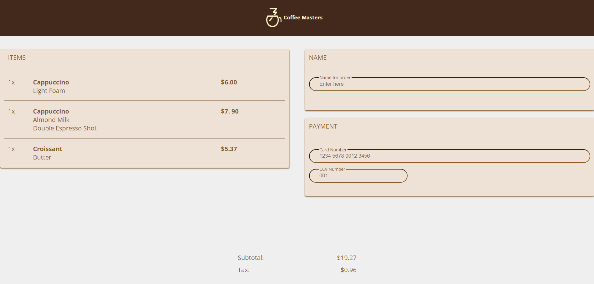
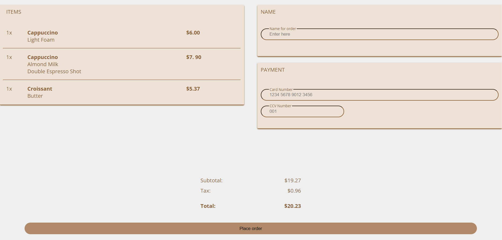

# Coffee Shop checkout solution


## Table of contents

- [Overview](#overview)
  - [The challenge](#the-challenge)
  - [Screenshot](#screenshot)<!-- - [Links](#links)-->
- [My process](#my-process)
  - [Built with](#built-with)
  - [What I learned](#what-i-learned)
  - [Continued development](#continued-development)
  - [Useful resources](#useful-resources)
- [Author](#author)
- [Acknowledgments](#acknowledgments)

<!--**Note: Delete this note and update the table of contents based on what sections you keep.**-->

## Overview

### The challenge

Users should be able to:

View a standard layout for a coffee shop checkout interface.

<!-- - View the optimal layout for the interface depending on their device's screen size
- See hover and focus states for all interactive elements on the page-->
### Screenshot




<!--Add a screenshot of your solution. The easiest way to do this is to use Firefox to view your project, right-click the page and select "Take a Screenshot". You can choose either a full-height screenshot or a cropped one based on how long the page is. If it's very long, it might be best to crop it.

Alternatively, you can use a tool like [FireShot](https://getfireshot.com/) to take the screenshot. FireShot has a free option, so you don't need to purchase it. 

Then crop/optimize/edit your image however you like, add it to your project, and update the file path in the image above.

**Note: Delete this note and the paragraphs above when you add your screenshot. If you prefer not to add a screenshot, feel free to remove this entire section.**-->

<!--### Links

- Solution URL: [Add solution URL here](https://your-solution-url.com)
- Live Site URL: [Add live site URL here](https://your-live-site-url.com)-->

## My process

### Built with

- Semantic HTML5 markup
- CSS custom properties
- Flexbox
- CSS Grid
<!-- - Mobile-first workflow-->

### What I learned

<!--Use this section to recap over some of your major learnings while working through this project. Writing these out and providing code samples of areas you want to highlight is a great way to reinforce your own knowledge.

To see how you can add code snippets, see below:

```html
<h1>Some HTML code I'm proud of</h1>
```
```css
.proud-of-this-css {
  color: papayawhip;
}
```

If you want more help with writing markdown, we'd recommend checking out [The Markdown Guide](https://www.markdownguide.org/) to learn more.

**Note: Delete this note and the content within this section and replace with your own learnings.**-->

The main area I developed in was learning the CSS Grid so now I can confidently use it going forward.

Example below:

.items {
    grid-column: 1 / 2;
    grid-row: 1 / 10;
    background-color: #eee1d5;
    border-radius: 3px;
    margin-top: 25px;
    display: grid;
    grid-template-rows: 10% repeat(auto-fill, 1fr);
    grid-template-columns: 10% 80% 10%;
    box-shadow: 0px 2px 3px #885a2d;
    margin-right: 20px;
}

### Continued development

<!--Use this section to outline areas that you want to continue focusing on in future projects. These could be concepts you're still not completely comfortable with or techniques you found useful that you want to refine and perfect.

**Note: Delete this note and the content within this section and replace with your own plans for continued development.**-->

I will find the time in the near future to recreate this design using the CSS Flexbox feature.

### Useful resources

- [Learn CSS Grid - A 13 Minute Deep Dive](https://www.youtube.com/watch?v=EiNiSFIPIQE) - This video helped me to quickly understand how to implement CSS Grid and I will use it going forward.
<!-- - [Learn CSS Grid - A 13 Minute Deep Dive](https://www.youtube.com/watch?v=EiNiSFIPIQE) - This helped me for XYZ reason. I really liked this pattern and will use it going forward.
- [Example resource 2](https://www.example.com) - This is an amazing article which helped me finally understand XYZ. I'd recommend it to anyone still learning this concept.

**Note: Delete this note and replace the list above with resources that helped you during the challenge. These could come in handy for anyone viewing your solution or for yourself when you look back on this project in the future.**-->

## Author

<!-- - Website - [Add your name here](https://www.your-site.com)-->
- Frontend Mentor - [OliverCadman](https://github.com/OliverCadman)
<!-- - Twitter - [@yourusername](https://www.twitter.com/yourusername)

**Note: Delete this note and add/remove/edit lines above based on what links you'd like to share.**-->

## Acknowledgments

<!--This is where you can give a hat tip to anyone who helped you out on this project. Perhaps you worked in a team or got some inspiration from someone else's solution. This is the perfect place to give them some credit.

**Note: Delete this note and edit this section's content as necessary. If you completed this challenge by yourself, feel free to delete this section entirely.**-->

I want to thank the software engineering trainers at Xander Talent for providing the resources and training for me to achieve this design.
